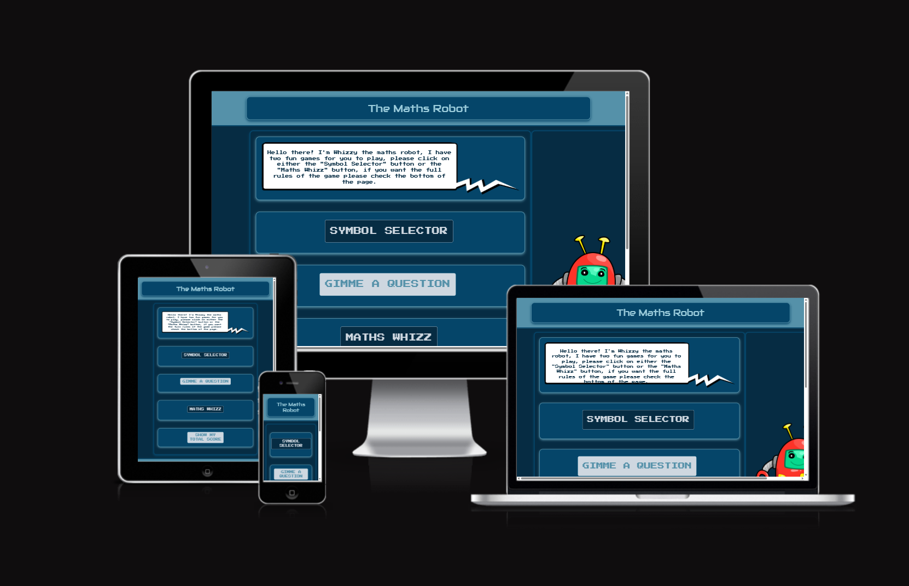
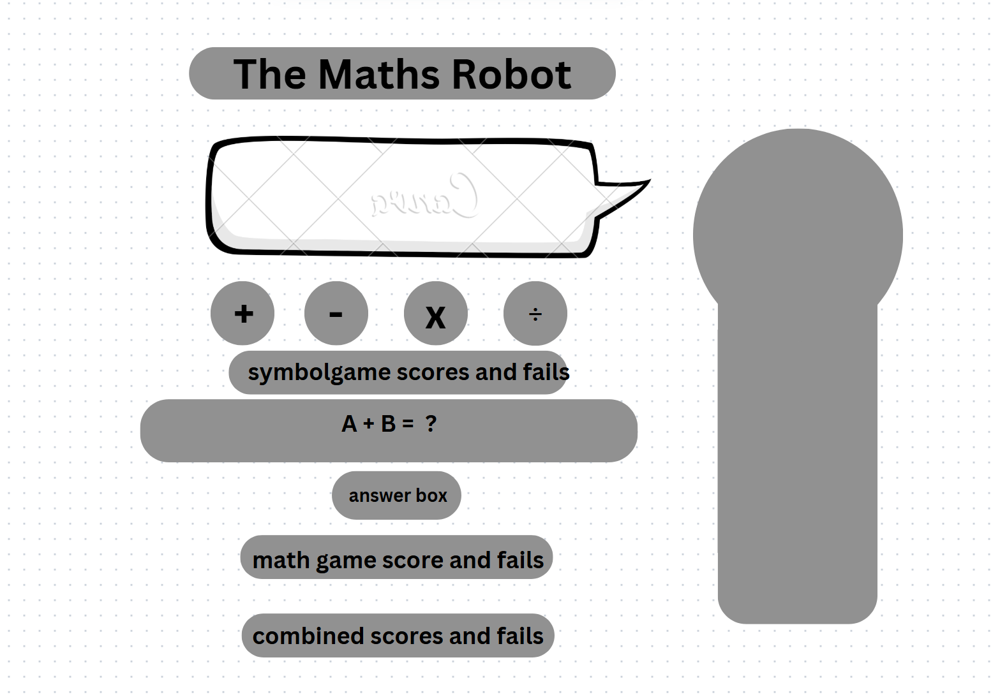
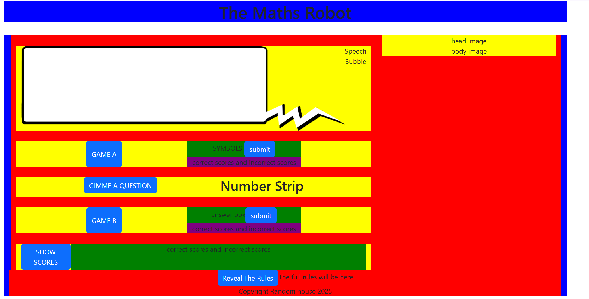
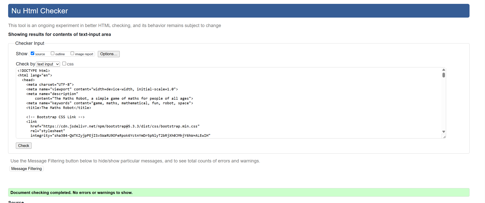
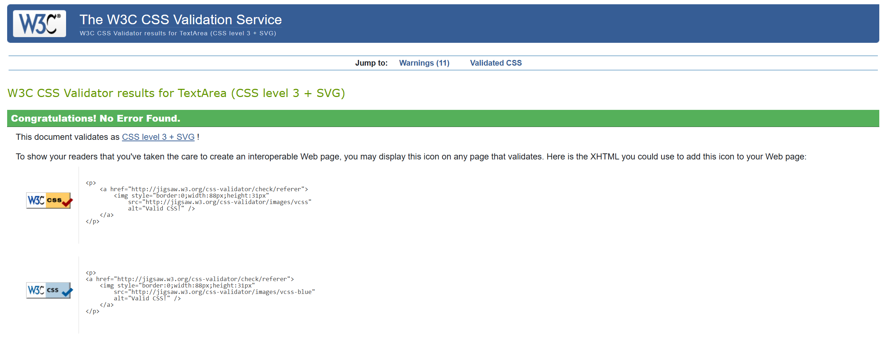
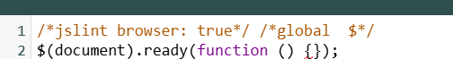
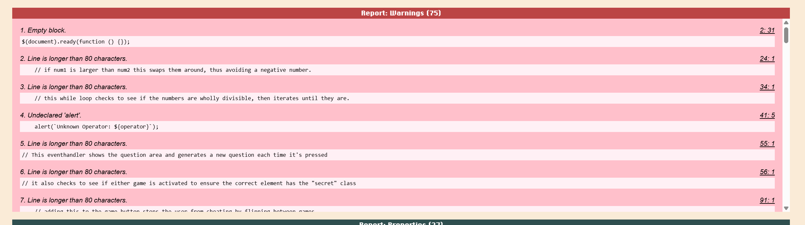
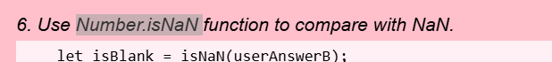
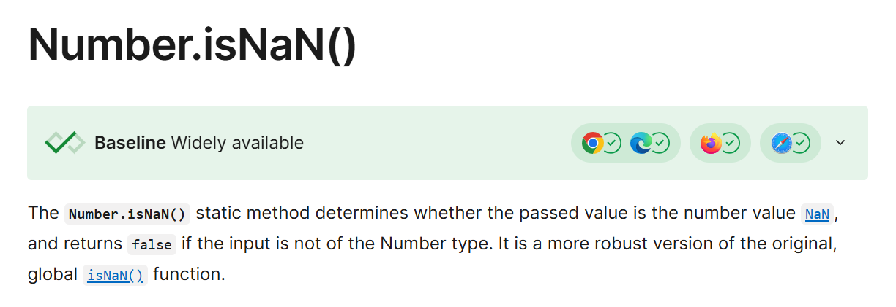
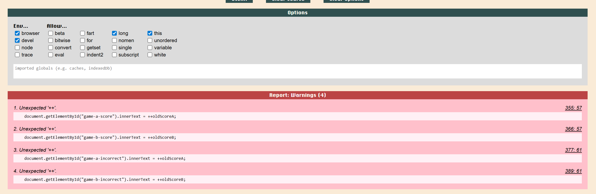

# [The Maths Robot](https://cjperk445.github.io/symbolguesser/)

<div style="text-align: center">

</div>

## Introduction

### What is this Project?

This is my second milestone project for the Code Insitute 4 project "Diploma in Web Development" Course. 

Interactive Frontend Development Milestone Project

I decided to build a simple javascript based game called "The maths robot" which hosts two seperate mathematical based games. 


### Project goals

1. To create a fun and interactive game for users to play
2. To make the website pretty to look at to keep the user engages
3. I wanted the website to have a space/robot theme. The colour palette and font choices would reflect this.
3. Have a way to tally the scores of both games to make it seem competitive. 
4. As a Site owner, it would be my goal to make a game that I would also enjoy playing.


## Features

-   Fully interactive environment utilizing javascript and Jquery
-   A reactive robot with very basic animation (facial features)
-   Two seperate games utilizing the same Maths equation.


## Technologies Used

### Languages Used

-   [HTML5](https://en.wikipedia.org/wiki/HTML5)
-   [CSS3](https://en.wikipedia.org/wiki/Cascading_Style_Sheets)
-   [JS ES6](https://en.wikipedia.org/wiki/JavaScript)

### Frameworks, Libraries & Programs Used

- [Bootstrap 5.3.3](https://getbootstrap.com/docs/5.3/getting-started/introduction/)
    - Bootstrap was used to utilize things such as column sizes and the container class
- [jQuery 3.7.1](https://jquery.com/)
    - jQuery was utilized extensively in writing the javascript, I found it easy and intuitive to use to create eventhandlers and functions.
- [VSCode](https://code.visualstudio.com/)
    - This was the IDE I used, created by microsoft. 
- [Google Fonts:](https://fonts.google.com/)
    - Google fonts were used to import the "Audiowide" and "Press Start 2p" fonts which I thought were good for a space/robot themed website. 
- [Font Awesome:](https://fontawesome.com/)
    - Font Awesome was used for the symbols in the symbol guesser.
- [GitHub:](https://github.com/)
    - I used Github to host my code and to deploy on github pages (explained in more detail later).
- [Canva:](https://www.canva.com/)
    - Used for creating simple wireframes of the site
- [Gimp](https://www.gimp.org/)
    - Gimp is a free to use alternative to Photoshop and was used to edit some images such as the robots face. 
- [WebAim](https://webaim.org/resources/contrastchecker/)
    - Used to check that the colour scheme had sufficient contrast
- [Jest 30.0](https://jestjs.io/)
    - Testing infrastructure to test out Javascript.
- [JSLint](https://www.jslint.com/)
    - Used to go through the Javascript code to look for any inconsistencies or errors.


## Wireframes

Created using [Canva:](https://www.canva.com/) + using the local host server to work on the structure. 

I created the original wireframes using Canva - I knew early on the rough layout for the site. I wanted a simple two large divs. The game area and the robot to the right. 
<div style="text-align: center">

</div>

I created the above image just to see the whole page spread out, the plan was always to have the games appear and dissappear depending on what button was chosen. 

I decided to seperate out the divs and their children into different boxes on canva to help visualize the final website better. 

<div style="text-align: center">

</div>

In the above image the following colour scheme was used. 

- Top div = Black frame
- First Child div = Red Frame
- Next child div = Green Frame

I soon found that I would have about 4 or 5 levels within this structure so decided to create the basic framework within my html and utilizing simple colors in CSS to show the hierarchy visually. 

<div style="text-align: center">

</div>

As you can see there are more levels to the divs here. 

- Top div = Blue
- Next level down =  Red
- Third level = Yellow
- Fourth Level = Green
- Fifth (and final level) = Purple

Having these bold colours show me the relationships between the levels within the site helped when it came to writing CSS and JS to understand what divs were nested within each other for ease of targeting. 

### Restructuring for CSS Responsiveness

Upon submitting the project first time around I had failed to take into account the need for making sure the website was respoonsive to different screen sizes. I should have started from the mobile up design but focused on the laptop size instead. 

I started restructuring the website to make it responsive by starting from the smallest screen size - I did this by hiding the Robot and the speech bubble as neither of these elements scaled down properly to look nice on the site. As the screen scales up the speech bubble re-appears at tablet size (768px and up) and then finally at the largest screen The Maths Robot appears. 

By hiding the robot at the smallest screen size it allowed all the elements to be placed into one long column instead of two, after some fiddling with the CSS I was able to correct my mistakes from the original submission and now it hopefully is much cleaner and can be used at any screen size. 

# Testing

## Manual testing

Below is a table describing the manual testing I did on the website, essentially this testing went from the top of the screen to the bottom. 

### General site functions

|           Action            |                                Expectation                                 | Outcome |
| :-------------------------: | :------------------------------------------------------------------------: | :-----: |
|           Button Hover - Symbol Selector           |                          When this button is hovered over it changes colour, then reverts to normal colour when it's not being hovered over                        |  Pass   |
|           Button Hover - Gimme a question            |                         When this button is hovered over it changes colour, then reverts to normal colour when it's not being hovered over                            |  Pass   |
|           Button Hover -Maths Whizz            |                          When this button is hovered over it changes colour, then reverts to normal colour when it's not being hovered over                         |  Pass   |
|           Button Hover - Show my total Score           |                          When this button is hovered over it changes colour, then reverts to normal colour when it's not being hovered over                           |  Pass   |
|           Button Hover- Reveal The Rules          |                          When this button is hovered over it changes colour, then reverts to normal colour when it's not being hovered over                      |  Pass   |
| 


### Game-A Functions
|           Action            |                                Expectation                                 | Outcome |
| :-------------------------: | :------------------------------------------------------------------------: | :-----: |
|        Click on symbol selector button        |                          Speech bubble changes to Game A text (on larger screens), Game A appears                           |  Pass   |
|       Click on Selector Button Again        |                 Speech bubble reverts to original and Game A disappears                |  Pass   |
|    "+"  Button    |            On Hover - changes color              |  Fail - changes color but loses the symbol   |
|    "+"  Button    |            On click - changes color and remains highlighted  - other buttons revert to normal           |  Pass   |
|    "-"  Button  |           On Hover - changes color              |  Fail - changes color but loses the symbol   |
|    "-"  Button  |            On click - changes color and remains highlighted  - other buttons revert to normal             |  Pass   |
|    "/"  Button  |           On Hover - changes color              |  Fail - changes color but loses the symbol   |
|    "/"  Button  |            On click - changes color and remains highlighted  - other buttons revert to normal              |  Pass   |
|    "*"   Button  |           On Hover - changes color              |  Fail - changes color but loses the symbol   |
|    "*"   Button  |           On click - changes color and remains highlighted  - other buttons revert to normal              |  Pass   |


### Game-B Functions
### Other Functions

Received a result of 98 in lighthouse in Devtools 

## Testing with Jest


## Validation

### HTML Validator

The HTML Validator used throughout was the [W3C](https://validator.w3.org/) Validator. Final checks on all pages flag up no errors nor warnings

<div style="text-align: center">

</div>

### CSS Validator

The CSS Validator used throughout was the [W3C](jigsaw.w3.org/css-validator/) Validator. All checks were clear

<div style="text-align: center">

</div>

### JS Validation

I used both [JShint](https://jshint.com/) and [Site24x7](https://www.site24x7.com/tools/javascript-validator.html) to validate the Javascript. Both sites kept alerting that "$" was an undefined variable however Site24x7 allows you to assume that we are using jQuery in the javascript. A few other small flags were that I was using ES6 functions however in testing with different browsers these didn't cause any issues. 

To add an extra layer of validation to my Javascript I ran my code through [JSLint](https://jslint.com). When first put through it flagged up 190 errors, however many of these are the aforementioned "$" issue, to silence these errors so I could focus on fixable ones I appended the following code to the top of the javascript in JSHint 

<div style="text-align: center">

</div>

With the above code injected a more manageable 75 issues were highlighted

<div style="text-align: center">

</div>

<br>
Many of the issues were that certain lines of code were too long (mainly comments) and stray white spaces. I edited the options in JSLint to ignore a few things - namely that "this" and "alert" were unexpected and undefined as well as to stop flagging up that certain lines of code were too long. for example the following code: 


```
  let gameAIncorrect = parseInt(document.getElementById("game-a-incorrect").innerText);
```

Was being flagged as too long, however I didn't want to cut it down as it's easily readable. 
One of the interesting errors/notes that came from JSList was the following:

<div style="text-align: center">

</div>

Upon further research I found the following information: 

<div style="text-align: center">

</div>

<br>

I then changed my original code which checked if the answer given in Game B was blank from the following

```
let isBlank = isNaN(userAnswerB);
```

to

```
let isBlank = Number.isNaN(userAnswerB);
```
After clearing nearly all the issues flagges I was left with the below:

<div style="text-align: center">

</div>

I chose to leave these in the code as I could not find a better way to write the code other than use ++. 

## Deployment

- The site was deployed to GitHub pages.

- Steps of deployment:

1. Open repository [The Maths Robot](https://cjperk445.github.io/symbolguesser/).
2. Go to settings.
3. Locate the Pages link in the menu section on the left of the screen.
4. Locate the Branch, click on none then and select main option.
5. Click on the save button.
6. After couple of minutes reload the page and you will have a live site at the top of the site.
7. Click on the link and it will take you to a live site. 

- Local deployment steps:

1. Open my repository [The Maths Robot](https://cjperk445.github.io/symbolguesser/).
2. Locate and click on the green button with Code written on it.
3. Copy the link from the menu
4. Clone the code onto your machine and start working on the code.

## Credits

### Code
- Took a lot of inspiration from the "Love Maths" module in the codeinstitute website. However I tried to change the code as much as I could to add my own twist to the maths game. Having two seperate games utilizing the same maths-sum threw up some challenges to overcome - such as switching which part of the sum was invisible. 
- used the below code for pressing return on different elements such as the selected buttons got from [StackOverflow](https://stackoverflow.com/questions/979662/how-can-i-detect-pressing-enter-on-the-keyboard-using-jquery)

```
$(document).on('keypress',function(e) {
    if(e.which == 13) {
        alert('You pressed enter!');
    }
});
```

changed to 

```
$("#answer-box").on('keypress',function(e) {
    if(e.which == 13) {
        checkAnswerB();
    }
});
```

and also used in 

```
$(".choice-button").on('keypress',function(e){
    if(e.which == 13){
        checkAnswerA();
    }
});
```


### Media

- I found a few color palettes I liked, I wanted to go for either a robot or space theme, The following color pallete is what I landed on, I checked the contrast on webaim and the contrast was deemed acceptable color palette [Paper Heart Design](https://paperheartdesign.com/blog/color-palette-awesome-space)
- The main robot was taken from [Pixabay](https://pixabay.com/illustrations/robot-cartoon-cute-kid-toy-alien-7615434/)
- I then created my own seperate faces for the robot in Gimp, and used jQuery to switch between faces if correct or incorrect answers were given created my own speech bubble using [Gimp](https://www.gimp.org/) image creator. 

